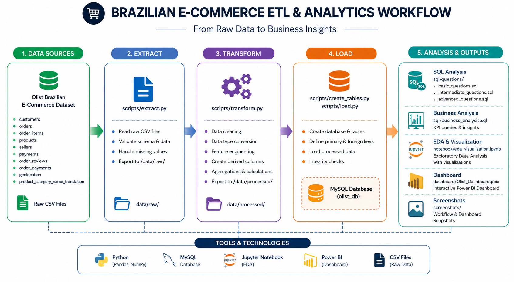
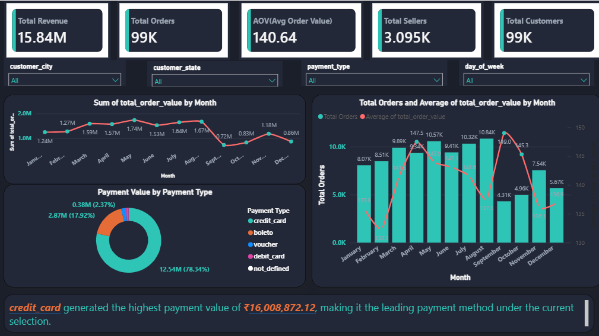
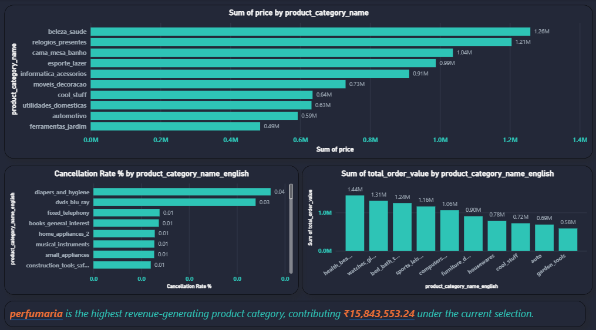
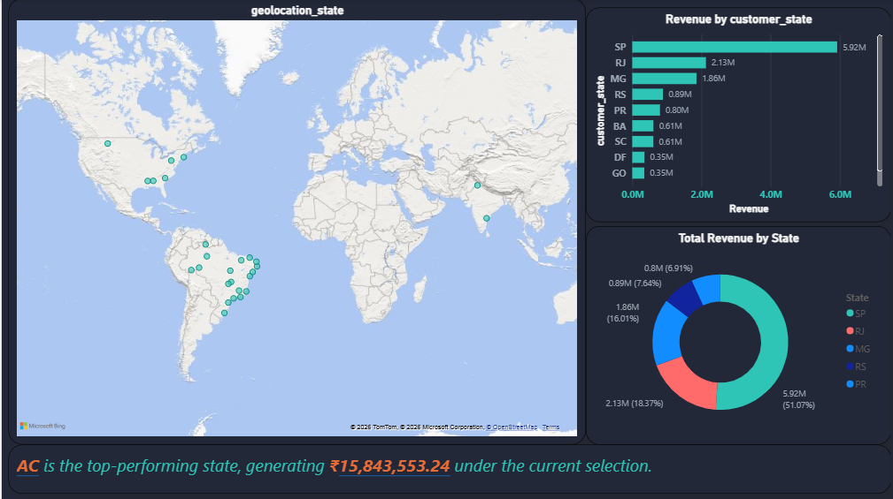
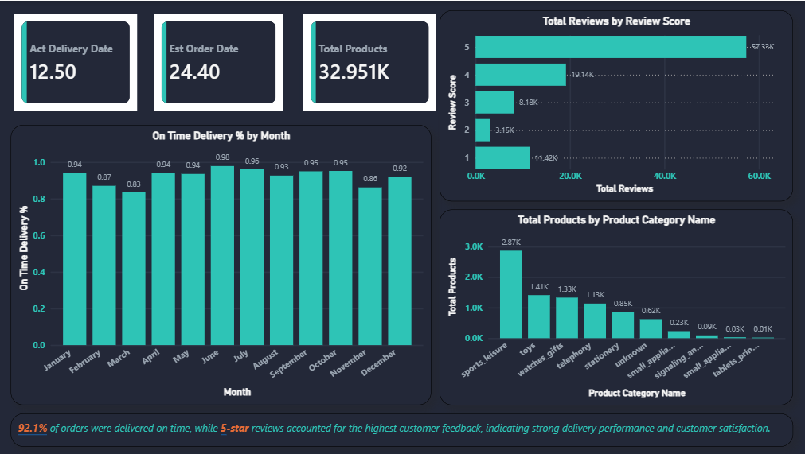

# 🛒 Brazilian E-Commerce ETL & Analytics Project

An end-to-end **ETL pipeline + SQL analytics + Power BI dashboard** project built on the Olist Brazilian E-Commerce dataset — covering the full journey from raw data to business insights.



---

## 📌 Project Overview

This project simulates a real-world data analytics workflow:

- **Extract** raw CSV data from the Olist Brazilian E-Commerce dataset
- **Transform** it using Python (cleaning, feature engineering, aggregations)
- **Load** the processed data into a MySQL database
- **Analyze** it using 50+ SQL queries (basic → advanced) and Python (EDA & visualization)
- **Visualize** insights through an interactive multi-page Power BI dashboard

---

## 🧰 Tech Stack

| Category | Tools |
|---|---|
| Programming | Python (Pandas, NumPy) |
| Database | MySQL |
| Visualization (EDA) | Jupyter Notebook, Matplotlib, Seaborn |
| Dashboard | Power BI |
| Data Format | CSV |

---

## 📂 Repository Structure

```
brazilian-ecommerce-etl-analytics/
│
├── scripts/
│   ├── extract.py          # Extracts raw CSV data
│   ├── transform.py        # Cleans & transforms data
│   ├── create_tables.py    # Creates MySQL database & tables
│   ├── load.py              # Loads processed data into MySQL
│   └── main.py               # Runs the full ETL pipeline
│
├── sql/
│   ├── sql_questions/
│   │   ├── basic_questions.sql
│   │   ├── intermediate_questions.sql
│   │   └── advanced_questions.sql
│   └── sql_analysis.sql     # Business analysis & KPI queries
│
├── notebook/
│   └── eda_visualization.ipynb   # Exploratory Data Analysis & visualizations
│
├── screenshots/
│   ├── dashboard_image1.png
│   ├── dashboard_image2.png
│   ├── dashboard_image3.png
│   ├── dashboard_image4.png
│   └── workflow.png
│
└── dashboard/
    └── Olist_Dashboard.pbix     # Interactive Power BI dashboard
```

> **Note:** The `data/raw/` and `data/processed/` folders are **not included** in this repository due to their large file size. See the [Dataset](#-dataset) section below to get the data and regenerate them locally.

---

## 📊 Dataset

This project uses the **[Brazilian E-Commerce Public Dataset by Olist](https://www.kaggle.com/datasets/olistbr/brazilian-ecommerce)** available on Kaggle.

The dataset consists of **9 CSV files**, including:
- `olist_customers_dataset.csv`
- `olist_orders_dataset.csv`
- `olist_order_items_dataset.csv`
- `olist_products_dataset.csv`
- `olist_sellers_dataset.csv`
- `olist_order_payments_dataset.csv`
- `olist_order_reviews_dataset.csv`
- `olist_geolocation_dataset.csv`
- `product_category_name_translation.csv`

All 9 files were extracted and transformed as part of this pipeline. However, the raw and processed data were **not uploaded to this repository** due to their large combined size. To regenerate the data locally:

1. Download the dataset from the [Kaggle link above](https://www.kaggle.com/datasets/olistbr/brazilian-ecommerce)
2. Place the CSV files inside a `data/raw/` folder
3. Run the ETL pipeline (see below)

---

## ⚙️ How to Run

```bash
# 1. Clone the repository
git clone https://github.com/codebyavneesh/brazilian-ecommerce-etl-analytics.git
cd brazilian-ecommerce-etl-analytics/brazilian-ecommerce-etl-analytics

# 2. Install dependencies
pip install pandas numpy mysql-connector-python sqlalchemy

# 3. Run the full ETL pipeline
python scripts/main.py
```

This will:
- Extract raw CSVs → `data/raw/`
- Transform & clean data → `data/processed/`
- Create MySQL database & tables
- Load processed data into MySQL (`olist_db`)

---

## 🔍 SQL Analysis

Over **50 SQL queries** covering:
- Window functions
- CTEs (Common Table Expressions)
- Subqueries
- Views & Stored Procedures
- Business KPIs (revenue, delivery performance, customer behavior, etc.)

📁 Explore: [`sql/sql_questions/`](brazilian-ecommerce-etl-analytics/sql/sql_questions/) and [`sql/sql_analysis.sql`](brazilian-ecommerce-etl-analytics/sql/sql_analysis.sql)

---

## 📈 Exploratory Data Analysis

Python-based EDA and visualizations (Matplotlib & Seaborn) covering sales trends, delivery times, customer segmentation, and category-wise performance.

📓 Notebook: [`notebook/eda_visualization.ipynb`](brazilian-ecommerce-etl-analytics/notebook/eda_visualization.ipynb)

---

## 📊 Power BI Dashboard

An interactive, multi-page dashboard built with a dark theme, connected to the MySQL backend.

<p align="center">
  
  
</p>
<p align="center">
  
  
</p>

---

## 🔄 Workflow Diagram


---

## 👤 Author

**Avneesh** ([@codebyavneesh](https://github.com/codebyavneesh))

- 🔗 LinkedIn: [linkedin.com/in/codebyavneesh](https://linkedin.com/in/codebyavneesh)
- 💻 GitHub: [github.com/codebyavneesh](https://github.com/codebyavneesh)

---

⭐ If you found this project useful, consider giving it a star!
